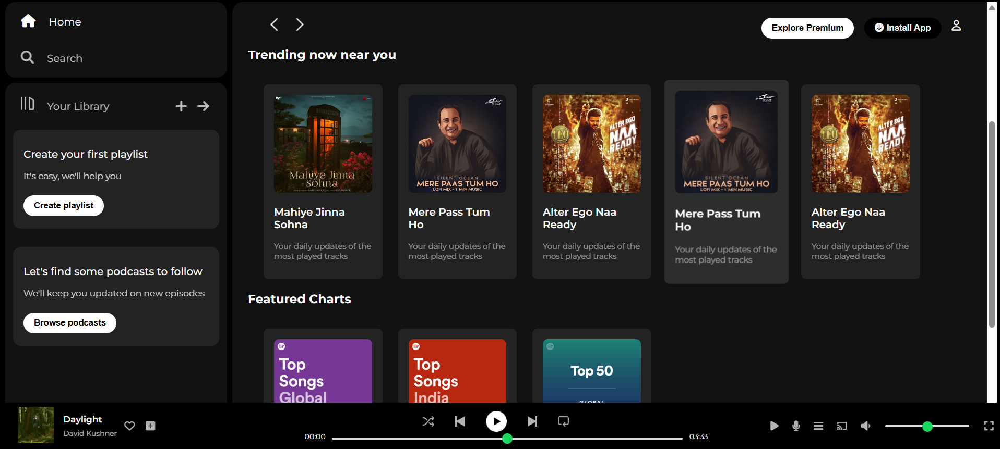

# 🎵 Spotify Clone - Frontend

A simple frontend clone of Spotify's music player interface, built using **HTML**, **CSS**, and **Font Awesome** icons.

## 🚀 Features

- Responsive music player layout
- Album artwork display
- Song title and artist name
- Interactive icons (Like, Add to playlist)
- Control bar and player controls UI

> ⚙️ This is a **frontend-only** project. Backend functionalities like playing songs, account login, or database connections will be added in future updates.

---

## 🛠️ Built With

- **HTML5**  
- **CSS3**
- **Font Awesome** (for icons)

---

## 📸 Screenshot



---

## 📂 Folder Structure
```php
📁 spotify-clone/
├── 📁 assets/                 
├── 📄 index.html
├── 📄 style.css              
├── 📄 spotify-clone.png      
└── 📄 README.md               
```

## 📬 Contact

Made with ❤️ by **Adithya S.**  
[LinkedIn](www.linkedin.com/in/adithya-s-027342237)

## 🌏 Live Preview
https://spotify-ui-clone-by-adithya.netlify.app/
